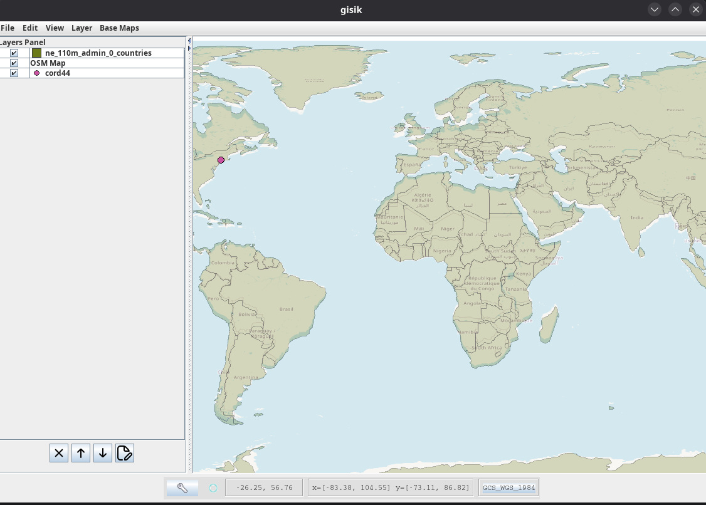
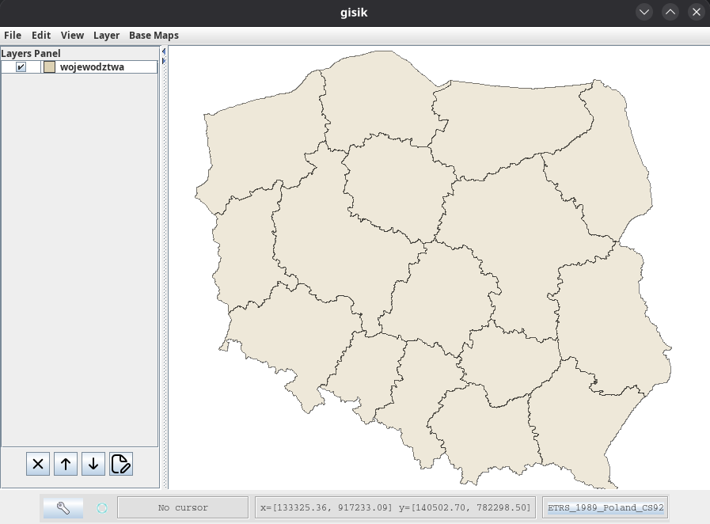

# gisik

gisik is a simple **GIS-like application** written in **Java**, based on the **GeoTools** library. The program allows loading and visualizing basic spatial data formats and displaying OpenStreetMap (OSM) as a basemap.

---

## 🗺️ Features

* Loading **Shapefiles** (`.shp`)
* Importing data from **CSV** files

  * Ability to interpret columns as spatial coordinates
* Displaying **OpenStreetMap (OSM)** basemap
* Basic visualization of GIS layers
* Support for multiple layers at the same time

---

##  Technologies

* **Java**
* **GeoTools** – core GIS library
* **OpenStreetMap** – basemap provider

---

##  Supported Data Formats

* **Shapefile** (`.shp`, `.shx`, `.dbf`, `.prj`)
* **CSV** (typically point data)

---

##  Running the Project

### Requirements

* **Java JDK 11** or newer
* **GeoTools** dependencies (handled via build system)

